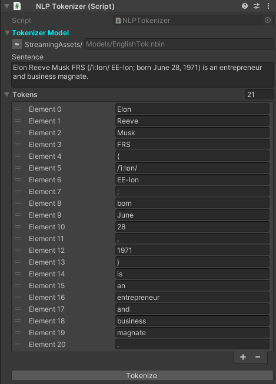
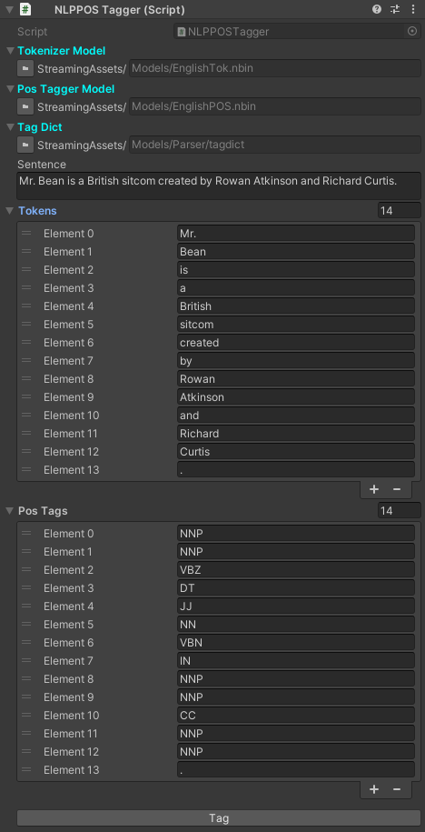

# Unity NLP

This package references 2 repositories, [OpenNLP](https://github.com/AlexPoint/OpenNlp) and [CherubNLP](https://github.com/SciSharp/CherubNLP). UnityNLP is a collection of natural language processing tools written in C# that is targeted towards the Unity Engine. Currently it provides the following NLP tools:

- [x] tokenizer
- [x] sentence splitter
- [x] part-of-speech tagger
- [x] chunker (used to "find non-recursive syntactic annotations such as noun phrase chunks")
- [x] parser
- [x] name finder
- [x] coreference tool
- [x] interface to the WordNet lexical database
- [x] topical classifier

You can find the documentation at: https://unitynlp.readthedocs.io/

## Table of contents
- [Unity NLP](#unity-nlp)
  - [Table of contents](#table-of-contents)
  - [Installation](#installation)
  - [Examples](#examples)
    - [Tokenizer](#tokenizer)
    - [Sentence Splitter](#sentence-splitter)
    - [Part of Speech](#part-of-speech)
    - [Named Entity Recognition](#named-entity-recognition)
    - [Multinomial Naive Bayes Classifier](#multinomial-naive-bayes-classifier)
  - [Support the project!](#support-the-project)
  - [Join the community!](#join-the-community)
  - [License](#license)
  - [References](#references)

## Installation

External dependencies:

- VX Util ([UnityUtil](https://github.com/voxell-tech/UnityUtil))
- VX AI ([UnityAI](https://github.com/voxell-tech/UnityAI))

1. Clone the [UnityUtil](https://github.com/voxell-tech/UnityUtil) repository into your `Packages` folder.
2. Clone the [UnityAI](https://github.com/voxell-tech/UnityAI) repository into your `Packages` folder.
3. Clone this repository into your `Packages` folder.
4. Download all [essential models](https://drive.google.com/file/d/19bD2h0LBIArczYtQMHuoqdNRuUZrWdOX/view?usp=sharing) and import them into the project.
5. Place the models in the StreamingAssets folder.
6. And you are ready to go!

*Make a feature request in the issues tab if you think there is something missing or if you have new ideas!*

## Examples

All the sample code are in the `Samples~` folder which can be imported into unity from the package manager.

### Tokenizer

### Sentence Splitter

### Part of Speech

For the full list of part of speech abbreviations, please refer to the [Penn Treebank Project](https://www.ling.upenn.edu/courses/Fall_2003/ling001/penn_treebank_pos.html).

### Named Entity Recognition

### Multinomial Naive Bayes Classifier

## Support the project!

## Join the community!

## License

This repository as a whole is licensed under the Apache License 2.0. Individual files may have a different, but compatible license.

See [license file](./LICENSE) for details.

## References

- [SharpNLP archive](https://archive.codeplex.com/?p=sharpnlp)
- [OpenNLP](https://github.com/AlexPoint/OpenNlp)
- [CherubNLP](https://github.com/SciSharp/CherubNLP)
