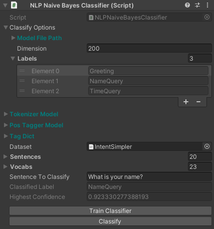

Topical Classifier
~~~~~~~~~~~~~~~~~~

A topical classifier classifies a sentence into a category.

Multinomial Naive Bayes Classifier
-----------------------------------

A multinomial naive bayes classifier is good at classifying short sentences.

Training a custom model
=======================

To train a model, you will need to prepare a dataset that contains labels and example sentences for each label.
As an example, here is a small dataset in JSON format.

.. code-block:: json

  {
    "intents": [
      {
        "intent": "Greeting",
        "text": [
          "Hi",
          "Hi there",
          "Hola",
          "Hello",
          "Hello there",
          "Hya",
          "Hya there"
        ]
      },
      {
        "intent": "NameQuery",
        "text": [
          "What is your name?",
          "What could I call you?",
          "What can I call you?",
          "What do your friends call you?",
          "Who are you?",
          "Tell me your name?"
        ]
      },
      { 
        "intent": "TimeQuery",
        "text": [
          "What is the time?",
          "What's the time?",
          "Do you know what time it is?",
          "Do you know the time?",
          "Can you tell me the time?",
          "Tell me what time it is?",
          "Time"
        ]
      }
    ]
  }

First, we "import" all the needed namespaces.

.. code-block:: csharp

  using System;
  using System.Collections.Generic;
  using UnityEngine;
  using Newtonsoft.Json;
  using Newtonsoft.Json.Linq;
  using Voxell;
  using Voxell.Inspector;
  using Voxell.NLP;
  using Voxell.NLP.Classifier;
  using Voxell.NLP.Tokenize;
  using Voxell.NLP.PosTagger;
  using Voxell.NLP.Stem;

Then, we create all variables that will be used throughout the examples.

- a serialized ``TextAsset`` field that act as a pointer to the JSON file in the Unity project.
- ``tokenizerModel``, ``posTaggerModel``, ``tagDict`` to store the model paths. We add the ``[StreamingAssetFilePath]`` attribute so that we can select the files through a button in the Unity Inspector.
- a list of ``Sentence`` that will be used to store our example sentences.
- ``ClassifyOptions`` to store the labels.
- ``NaiveBayesClassifier`` as the classifer itself.
- ``EnglishMaximumEntropyTokenizer`` as our sentence tokenizer.
- ``EnglishMaximumEntropyPosTagger`` as our part of speech tagger.
- ``RegexStemmer`` as our token stemmer.

.. code-block:: csharp

  public TextAsset dataset;
  // or
  [SerializedField] private TextAsset _dataset;

  [StreamingAssetFilePath] public string tokenizerModel;
  [StreamingAssetFilePath] public string posTaggerModel;
  [StreamingAssetFilePath] public string tagDict;

  public ClassifyOptions classifyOptions;
  public List<Sentence> sentences;

  private NaiveBayesClassifier _classifier;
  private EnglishMaximumEntropyTokenizer _tokenizer;
  private EnglishMaximumEntropyPosTagger _posTagger;
  private RegexStemmer _stemmer;

We can now extract the JSON data above and turn them into ``Sentences``
and populate the labels in ``ClassifyOptions``.
We also convert all the sentences to lower case to prevent duplicated tokens that represent the same word.

.. code-block:: csharp

  public void InitializeData()
  {
    // reset data
    sentences.Clear();
    classifyOptions.labels.Clear();

    // create _tokenizer, pos tagger, and _stemmer
    _tokenizer = new EnglishMaximumEntropyTokenizer(FileUtilx.GetStreamingAssetFilePath(tokenizerModel));
    _posTagger = new EnglishMaximumEntropyPosTagger(
      FileUtilx.GetStreamingAssetFilePath(posTaggerModel),
      FileUtilx.GetStreamingAssetFilePath(tagDict));
    _stemmer = new RegexStemmer();
    _stemmer.CreatePattern();

    // generate data
    JObject data = JsonConvert.DeserializeObject<JObject>(dataset.text);
    JToken intents = data["intents"];

    foreach (JToken intent in intents)
    {
      string label = (string)intent["intent"];
      classifyOptions.AddLabel(label);
      // convert each sentences into a Sentence class and add it into the list
      foreach (JToken text in intent["text"])
        sentences.Add(new Sentence(
          ((string)text).ToLower(),
          label,
          _tokenizer, _posTagger, _stemmer
        ));
    }
  }

Now that we have our data converted nicely, we can train the classifer.
A ``[Button]`` attribute is added so that we can run this function from the Unity Inspector.

.. code-block:: csharp

  [Button]
  public void TrainClassifier()
  {
    InitializeData();
    // train and save the model
    _classifier = new NaiveBayesClassifier();
    _classifier.Train(sentences, classifyOptions);
    _classifier.SaveModel(classifyOptions);
  }

Classifying a sentence
======================

We will create another button on the Unity Inspector to classify a given sentence.
But before that, we will need to create some new variables to hold the sentence that we want to classify
and the result from the classfier model.

.. code-block:: csharp

  public string sentenceToClassify;
  [InspectOnly] public string classifiedLabel;
  [InspectOnly] public double highestConfidence;

And now, the classify function.

.. code-block:: csharp

  [Button]
  public void Classify()
  {
    if (_tokenizer == null)
    {
      // recreate _tokenizer, pos tagger, and _stemmer if editor is being refreshed
      _tokenizer = new EnglishMaximumEntropyTokenizer(FileUtilx.GetStreamingAssetFilePath(tokenizerModel));
      _posTagger = new EnglishMaximumEntropyPosTagger(
        FileUtilx.GetStreamingAssetFilePath(posTaggerModel),
        FileUtilx.GetStreamingAssetFilePath(tagDict));
      _stemmer = new RegexStemmer();
      _stemmer.CreatePattern();
    }

    // convert string sentence to Sentence class
    Sentence sent = new Sentence(sentenceToClassify.ToLower(), "", _tokenizer, _posTagger, _stemmer);
    _classifier = new NaiveBayesClassifier();
    _classifier.LoadModel(classifyOptions);

    List<Tuple<string, double>> result = _classifier.Classify(sent, classifyOptions);

    classifiedLabel = "";
    highestConfidence = 0.0;
    for (int r=0; r < result.Count; r++)
    {
      if (result[r].Item2 > highestConfidence)
      {
        classifiedLabel = result[r].Item1;
        highestConfidence = result[r].Item2;
      }
    }
  }

Full Script
===========

Here is the full demo script. I have added some extra variables and code to view the output of the classifier for debugging purposes.
You can find this sample script by importing the `NLP Basic Examples` from the `Package Manager`.

.. code-block:: csharp

  using System;
  using System.Collections.Generic;
  using UnityEngine;
  using Newtonsoft.Json;
  using Newtonsoft.Json.Linq;
  using Voxell;
  using Voxell.Inspector;
  using Voxell.NLP;
  using Voxell.NLP.Classifier;
  using Voxell.NLP.Tokenize;
  using Voxell.NLP.PosTagger;
  using Voxell.NLP.Stem;

  public class NLPNaiveBayesClassifier : MonoBehaviour
  {
    public ClassifyOptions classifyOptions;
    [StreamingAssetFilePath] public string tokenizerModel;
    [StreamingAssetFilePath] public string posTaggerModel;
    [StreamingAssetFilePath] public string tagDict;

    public TextAsset dataset;
    public List<Sentence> sentences;
    public List<string> vocabs;
    public string sentenceToClassify;
    [InspectOnly] public string classifiedLabel;
    [InspectOnly] public double highestConfidence;

    private NaiveBayesClassifier classifier;
    private EnglishMaximumEntropyTokenizer tokenizer;
    private EnglishMaximumEntropyPosTagger posTagger;
    private RegexStemmer stemmer;

    public void InitializeData()
    {
      // reset data
      sentences.Clear();
      sentences.TrimExcess();
      classifyOptions.labels.Clear();
      classifyOptions.labels.TrimExcess();

      // create tokenizer, pos tagger, and stemmer
      tokenizer = new EnglishMaximumEntropyTokenizer(FileUtil.GetStreamingAssetFilePath(tokenizerModel));
      posTagger = new EnglishMaximumEntropyPosTagger(
        FileUtil.GetStreamingAssetFilePath(posTaggerModel),
        FileUtil.GetStreamingAssetFilePath(tagDict));
      stemmer = new RegexStemmer();
      stemmer.CreatePattern();

      // generate data
      var data = JsonConvert.DeserializeObject<JObject>(dataset.text);
      JToken intents = data["intents"];
      foreach (JToken intent in intents)
        classifyOptions.AddLabel((string)intent["intent"]);

      foreach (JToken intent in intents)
      {
        // convert each sentences into a Sentence class and add it into the list
        foreach (JToken text in intent["text"])
          sentences.Add(new Sentence(
            ((string)text).ToLower(),
            (string)intent["intent"],
            tokenizer, posTagger, stemmer
          ));
      }
    }

    [Button]
    public void TrainClassifier()
    {
      InitializeData();
      // train and save the model
      classifier = new NaiveBayesClassifier();
      classifier.Train(sentences, classifyOptions);
      classifier.SaveModel(classifyOptions);
    }

    [Button]
    public void Classify()
    {
      if (tokenizer == null)
      {
        // recreate tokenizer, pos tagger, and stemmer if editor is being refreshed
        tokenizer = new EnglishMaximumEntropyTokenizer(FileUtil.GetStreamingAssetFilePath(tokenizerModel));
        posTagger = new EnglishMaximumEntropyPosTagger(
          FileUtil.GetStreamingAssetFilePath(posTaggerModel),
          FileUtil.GetStreamingAssetFilePath(tagDict));
        stemmer = new RegexStemmer();
        stemmer.CreatePattern();
      }

      // convert string sentence to Sentence class
      Sentence sent = new Sentence(sentenceToClassify.ToLower(), "", tokenizer, posTagger, stemmer);
      classifier = new NaiveBayesClassifier();
      classifier.LoadModel(classifyOptions);

      // take a look at all the vocabs that the classifier stored
      vocabs = classifier.words;
      List<Tuple<string, double>> result = classifier.Classify(sent, classifyOptions);

      classifiedLabel = "";
      highestConfidence = 0.0;
      for (int r=0; r < result.Count; r++)
      {
        if (result[r].Item2 > highestConfidence)
        {
          classifiedLabel = result[r].Item1;
          highestConfidence = result[r].Item2;
        }
      }
    }
  }

