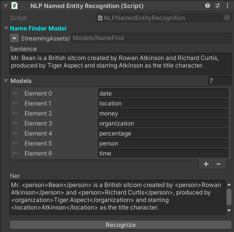

Named Entity Recognition
~~~~~~~~~~~~~~~~~~~~~~~~

A Named Entity Recognition (NER) identifies key information in a sentence. These detected entities will also be classified into a category.

English Name Finder
-------------------

Example
=======

In this example, a pretrained model that is capable of identifying 7 categories is used to *"recognize"* a sentence.

.. code-block:: csharp

  using UnityEngine;
  using Voxell;
  using Voxell.NLP.NameFind;
  using Voxell.Inspector;

  public class NLPNamedEntityRecognition : MonoBehaviour
  {
    [StreamingAssetFolderPath] public string nameFinderModel;
    [TextArea(1, 5)] public string sentence;
    public string[] models = new string[]
    { "date", "location", "money", "organization", "percentage", "person", "time" };
    [TextArea(1, 5), InspectOnly] public string ner;

    private EnglishNameFinder nameFinder;

    [Button]
    public void Recognize()
    {
      nameFinder = new EnglishNameFinder(FileUtil.GetStreamingAssetFilePath(nameFinderModel));
      ner = nameFinder.GetNames(models, sentence);
    }
  }

