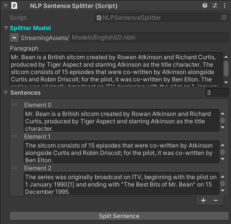

Sentence Splitter
~~~~~~~~~~~~~~~~~

A sentence splitter splits a paragraph into individual sentences.

English Maximum Entropy Sentence Detector
-----------------------------------------

Example
=======

In this example, a pretrained model is used to split the paragraph into 3 individual sentences.

**Note:**
One might think that it is easy to split sentences. For example, we could just detect full stops and split the text based on the location of the full stop in the sentence. This however will not always work. If you look at the sentences below closely, you will notice that there are multiple occurrence of the word **"Mr."** which consists of a full stop in itself. An accurate sentence splitter must be able to identify it.

.. code-block:: csharp

  using UnityEngine;
  using Voxell;
  using Voxell.NLP.SentenceDetect;
  using Voxell.Inspector;

  public class NLPSentenceSplitter : MonoBehaviour
  {
    [StreamingAssetFilePath] public string splitterModel;
    [TextArea(1, 5)] public string paragraph;
    [TextArea(1, 3)] public string[] sentences;

    private EnglishMaximumEntropySentenceDetector sentenceDetector;

    [Button]
    void SplitSentence()
    {
      sentenceDetector = new EnglishMaximumEntropySentenceDetector(FileUtil.GetStreamingAssetFilePath(splitterModel));
      sentences = sentenceDetector.SentenceDetect(paragraph);
    }
  }

